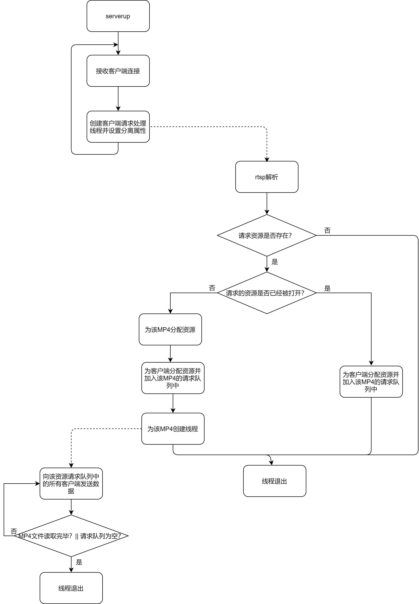

# rtsp-over-tcp-server
仅支持rtp over tcp，视频文件格式mp4，视频编码格式H264,可以包含音频，但是rtsp_server只会回放视频，有多个rtsp客户端请求同一个视频时，不同客户端收到的视频是同步的。

# 编译运行
* mkdir mp4path
* make
* ./rtsp_server

# RTSP拉流
* 把要回放的视频放到mp4path中，通过rtsp://ip:8554/mp4文件名字即可回放

# 技术交流
* kxsun617@163.com
